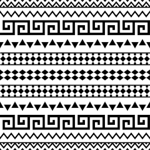
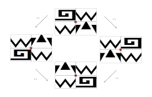
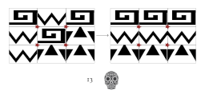

# Problem A - Aztec Vaults

## Description

The year is 1950. You are a curious archaeology undergrad fascinated by the ancient culture of the South American people. Your teacher, Dr. Henry Jones, invites you on a trip to the depths of northern Mexico, in search of the lost **Montezuma Treasure**, an invitation that you gladly accept. For two weeks, you will meander in the lost cities of the Aztecs, fighting for survival and for your credit assignments that will allow you to graduate. Just when everything seems lost, you find your way into a hidden tunnel, filled with curious Aztec patterns (Figure 1).

  
Figure 1 - Aztec patterns. [1]

At the end of the tunnel, you stumble into a wall, filled with vault handles. You have found the **Vault to the Montezuma Treasure!** As you start to celebrate, Dr. Jones warns you that this is not the moment to be happy. You are surrounded by skeletons of past treasure hunters, who failed to open the vault (Figure 2).

  
Figure 2 - The Aztec Vault. Vault handles are represented in dark red.

The wall has several blocks, each with a pattern design. There is a vault handle in the middle of each 2x2 block grid. You play around with the vault handles, and you notice that when you rotate the handle, the surrounding 4 blocks rotate in the same direction (Figure 3)!

  
Figure 3 - Possible rotations of a vault handle. You can rotate either to the left or to the right. A move is counted each time you rotate.

As Dr. Jones inspects the surroundings, he finds a drawing of the correct configuration that unlocks the vault. That must mean you need to rearrange the blocks to fix the patterns in order to open the vault. Next to the drawing there is also a number and a skull (Figure 4). "Hum, what do you make of this?" Dr. Jones asks you. "Well sir, I would suspect that we have a limited number of moves we can make to open the vault, until the Aztec traps kill us like our friends here!", you reply. "I believe you are right. And you just wasted precious moves by fiddeling around with the handles!".

  
Figure 4 - The Aztec Vault. On the left, the initial configuration. On the right, the correct configuration that opens the vault. Only 13 moves are allowed to unlock the vault.

Your mission is to rotate the vault handles in the **minimum** possible number of moves that restore it to its correct position!

**Note:** The blocks are all considered the same if they share a pattern. What matters is that each pattern is in its corresponding line, i.e., pattern 1 must be in line 1 and so forth (Figure 5).

  
Figure 5 - Vault representation.

## Input

The input starts with one line containing one integer T that corresponds to the number of test cases. Then, T input blocks follow.

Each input block starts with a line containing the number of rows R and columns C of the grid G, and the maximum number of moves allowed M, separated by whitespace. Then, R lines follow, each representing a row of the vault grid, containing C integers separated by whitespace.

## Output

For each test case, you should print the minimum number of moves S required to restore the vault grid to its correct position in the format "S\n". If no solution is found, you should output "the treasure is lost!\n".

## Constraints

2 <= R <= 5
2 <= C <= 5
R <= C
1 <= M <= 7
1 <= Gi,j <= R

## Example

### Example Input

    3
    2 3 5
    2 2 1
    2 1 1
    3 3 4
    1 2 3
    2 1 3
    1 2 3
    3 4 5
    1 2 1 2
    3 2 1 1
    3 3 3 2

### Example Output

    3
    the treasure is lost!
    4

## Explanation

There are 3 test cases, where the first is a 2x3 grid with a maximum of 5 moves, the second is a 3x3 grid with a maximum of 5 moves and the third is a 4x2 grid with a maximum of 10 moves.

In the first example, there are only two vault handles we can rotate, in a 2x3 grid. The solution can be achieved by rotating the first handle twice (either to the left or to the right), and rotating the second handle once to the left, with a total of 3 moves.

    2 2 1       2 2 1        1 2 1           1 1 1
     ->          ->             ->   
    2 1 1       1 2 1        2 2 1           2 2 2
