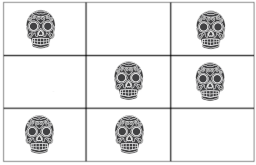

# Problem B - Another Aztec Riddle

## Description

Once you found the minimum number of moves to open the vault, you and Dr. Henry Jones entered into a secret chamber. The Montezuma Treasure was finally in front of you, and you felt that particular shiver down the spine. What a satisfaction of seeing your dream come true! Both of you were completely flabbergasted by such amount of gold and gems.

Time to wake up! You started filling up your knapsack. You soon realized that the knapsack was not enough, so you decided to use your socks, your pockets, your hat, anything that could be used to collect the remaining pieces.

But, suddenly, a deep voice was heard out of the chamber.

"Life is not that easy, there is still another riddle to be solved."

And the door of the chamber closed. You felt again another shiver down the spine, but for a completely different reason. You soon realized that there was no possibility of getting out of the chamber. "What can we do now?", you asked to Dr. Jones, who shook his head and said, "My son, I fear that this is not going to end well". You started to feel desperate! You and Dr. Jones had eaten all the food during the trip, and there was very little drinking water in the bottle. And, of course, no one would hear you screaming for help inside the chamber. What a nightmare this has become!

As soon as you sat down over your knapsack, a flat object fell into your hands. What is this? "The Aztecs were known to master many technologies, but I don't have any idea what this could be", Dr. Jones commented. You inspected the object and noticed that there was a grid carved into the surface. At that moment, several cards with skulls fell close to your foot. Curiously enough, each card would fit into each cell of the grid. "That's weird, it looks like a very macabre game, but I guess it has to do with the riddle," you said. "I am sure it does!", Dr. Jones replied.

You heard the deep voice again.

"If you solve this riddle, I will open the door for you. I will give you two numbers, let us call them c and r. You need to place the cards over the grid cells such that the number of cards in every column is equal to c and the number of cards in every row is equal to r. Once you find a way, you say out loud One".

"Okay, this does not seem to be a very hard riddle", you thought. "The vaults problem looked much harder". You started to imagine how this card assignment would look like. Figure 1 shows an example for a grid of size 2x3 for which the total number of cards in each row and each column is 2.

  
Fig.1 - A card assignment example
But the deep voice continued.

"Once you are done, I will check your card assignment. Your goal is to find another distinct card assignment in the grid, such that the row and column requirements are fullfilled. If you find it, say out loud Two. Repeat the process, stating how many distinct card assignments you have found."

"This is not going to be easy", you commented. By doing some simple math (you did quite well in Discrete Maths, by the way), you noticed that the number of distict card assignments can be very large for the grid object in your hands.

"Once you find the total number, stop and call me. I will check if the total number is correct. If it is, I will open the door for you. Otherwise, you will stay in this chamber for the rest of your life."

To make their lives easier, your goal is to develop a program that, given a grid of a certain size, reports the total number of distinct card assignments according to the column and row requirements described above.

## Input

The input starts with one line containing one integer T that corresponds to the number of test cases. Then, two lines follow. The first line contains the number of columns (nc) and rows ( nr ) of the grid. The next line contains the values for c and r.

## Output

For each test case, you should print the total number of distinct card assignments in a grid of size nc x nr such that the total number of cards in every row is r and the total number of cards in every column is c. This number is always less than 263.

## Constraints

2 <= nr <= 24
2 <= nc <= 24
1 <= r <= 7
1 <= c <= 7

## Example Input

    3
    2 2 
    1 1
    2 4
    2 1
    2 8
    4 1

## Example Output

    2
    6 
    70

## Explanation

There are 3 test cases, where the first is a 2x2 grid, the second is a 2x4 grid and the third is a 2x8 grid. In the first example, There are only two possibilies for c = 1 and r = 1:

     C - - C
     - C C -

where C is the place where the card would be in the grid.
